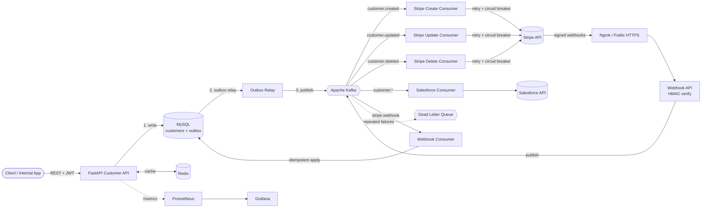
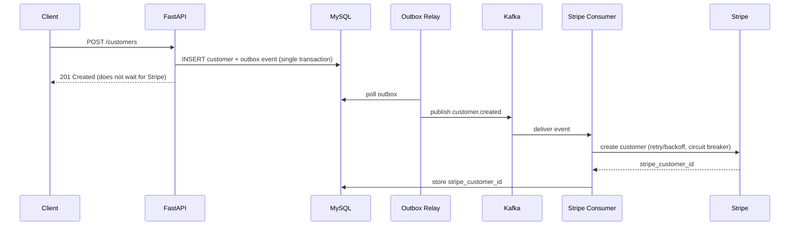
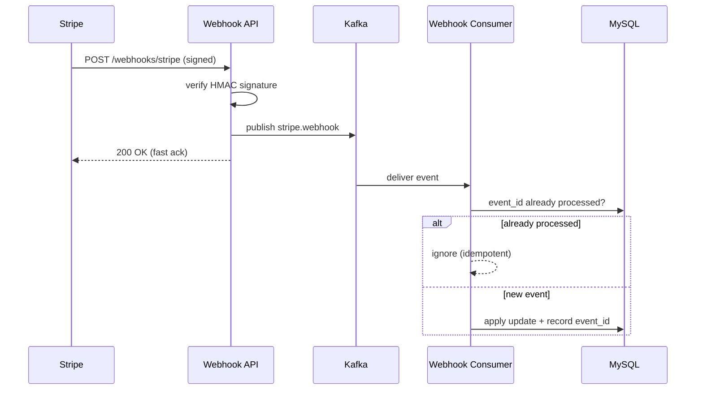

<div align="center">

# Two-Way Real-Time Data Integration Platform

**An event-driven platform that keeps an internal customer database and Stripe synchronized in both directions, in real time.**

FastAPI · Apache Kafka · MySQL · Redis · Stripe · Docker · Kubernetes


</div>

---


## Table of Contents

1. [Overview](#overview)
2. [The Problem](#the-problem)
3. [High-Level Architecture](#high-level-architecture)
4. [Why Event-Driven?](#why-event-driven)
5. [How It Works](#how-it-works)
6. [Reliability & Safety Guarantees](#reliability--safety-guarantees)
7. [Data Model](#data-model)
8. [Kafka Topics & Consumers](#kafka-topics--consumers)
9. [API Reference](#api-reference)
10. [Security](#security)
11. [Observability](#observability)
12. [Multi-Tenancy](#multi-tenancy)
13. [Tech Stack](#tech-stack)
14. [Project Structure](#project-structure)
15. [Getting Started](#getting-started)
16. [Local Webhook Development (Ngrok)](#local-webhook-development-ngrok)
17. [Deployment (Kubernetes)](#deployment-kubernetes)
18. [CI/CD](#cicd)
19. [Performance](#performance)
20. [Design Decisions & Trade-offs](#design-decisions--trade-offs)
21. [License](#license)

---

## Overview

Almost every SaaS company has the same shape of problem: an internal database, plus Stripe for billing, plus a CRM such as Salesforce. Each system stores its own copy of "who the customer is." When those copies drift apart (the database says *John*, Stripe says *Johnny*, the CRM says *John Smith*), billing fails, invoices go out wrong, emails misfire, and reports lie.

This platform guarantees that an **internal customer database** and **Stripe** stay consistent **in both directions**:

- **Outbound:** a change made through our API propagates to Stripe.
- **Inbound:** a change made directly in the Stripe dashboard propagates back to our database.

Both directions run through the **same Kafka-based event backbone**, so there is one consistent, durable, retryable pipeline instead of two separately built code paths.

### Highlights

- **Non-blocking API.** The request path never calls Stripe. It validates, writes to MySQL, publishes an event, and returns.
- **Two-way sync** via Kafka consumers (outbound) and verified Stripe webhooks (inbound).
- **HMAC-verified webhooks** to reject spoofed, tampered, and replayed requests.
- **Idempotent processing.** At-least-once delivery from Stripe and Kafka becomes effectively exactly-once logical processing.
- **Transactional Outbox** so the DB write and the Kafka publish are atomic.
- **Resilience patterns:** exponential-backoff retries, circuit breaker, and Dead Letter Queue with replay.
- **Pluggable integrations.** Stripe is the first consumer; Salesforce is a second consumer on the same events, with zero changes to the API layer.
- **Production concerns built in:** JWT/OAuth auth, multi-tenancy, Redis caching, Prometheus/Grafana, health endpoints, tracing, Kubernetes manifests, CI/CD.
- **One-command local environment** via Docker Compose.

---

## The Problem

| Failure mode | What goes wrong |
|---|---|
| Name/email drift between systems | Invoices addressed to the wrong person, emails sent to stale addresses |
| Deleted in one system, alive in another | Orphaned billing records, ghost customers |
| Synchronous calls to a 3rd-party API | Your API's uptime becomes a function of Stripe's uptime |
| Webhooks trusted blindly | Anyone can POST a fake "customer deleted" event |
| Webhook retries | One real event processed many times |
| DB write succeeds, event publish fails | Systems silently diverge |

This project exists to solve each of those rows correctly and durably.

---

## High-Level Architecture

<div align="center">


*High-level system architecture*

</div>

### Component view



### Request flow: outbound (our system → Stripe)



### Request flow: inbound (Stripe → our system)



---

## Why Event-Driven?

The naive implementation is an endpoint that calls Stripe inside the same request:

```
API → Stripe → Return
```

This couples your API's latency and uptime directly to a third party you don't control. If Stripe is slow, every request is slow. If Stripe is down, your customer-management API is effectively down too. It also cannot scale horizontally in any meaningful way, because every instance blocks on the same external call.

The platform restructures the flow around Kafka:

```
API → Kafka → Worker → Stripe
```

| Benefit | How |
|---|---|
| Fast, stable API latency | API only validates, writes to MySQL, and enqueues an event |
| Isolation from Stripe outages | Failures stay inside the consumer, not the request path |
| Natural retries | A failed consumer job is retried without the client doing anything |
| Independent scaling | API instances and consumers scale separately |
| Pluggable integrations | New systems (Salesforce, HubSpot…) are just new subscribers |

---

## How It Works

### 1. Customer CRUD API
FastAPI exposes `POST/GET/PUT/DELETE /customers`. Requests are validated by Pydantic, persisted in MySQL, and a domain event (`customer.created | updated | deleted`) is recorded in the **outbox** within the same transaction.

### 2. Outbox relay
A relay process reads unpublished outbox rows and publishes them to Kafka, marking them sent only after the broker acknowledges. This makes "DB write" and "event publish" effectively atomic.

### 3. Dedicated consumers
Each concern has its own consumer (create, update, delete, webhook, Salesforce), so logic stays focused and each one scales independently.

### 4. Stripe webhooks
Stripe calls our webhook endpoint when something changes on its side. The endpoint verifies the signature, publishes the event to the `stripe.webhook` topic, and acknowledges immediately. A consumer applies the change to MySQL.

### 5. Loop prevention
Updates applied from a Stripe webhook must not bounce back to Stripe as a new outbound update. Events carry an origin marker so a change that arrived from Stripe is not re-published to Stripe.

---

## Reliability & Safety Guarantees

### HMAC signature verification
Every incoming webhook is verified against the `Stripe-Signature` header using the signing secret and the **raw** request body. Invalid signatures are rejected before anything touches Kafka. This blocks spoofed requests, tampered payloads, and (via the signed timestamp tolerance) replays of old payloads.

### Idempotent event processing
Webhooks and Kafka both guarantee **at-least-once** delivery. Correctness is built into processing instead of assumed from the transport:

- Every event has a unique `event_id`.
- Before processing, the consumer checks the `processed_events` table.
- If the ID exists, the event is ignored; otherwise it is applied and recorded.

Result: effectively exactly-once *logical* processing on top of at-least-once delivery.

### Transactional Outbox
The customer write and the outbox event commit in a single MySQL transaction. A crash between "DB write" and "Kafka publish" can no longer leave the two inconsistent.

### Retries with exponential backoff
Transient Stripe failures are retried with increasing delays (**1s → 2s → 4s → 8s**).

### Circuit breaker
If Stripe is detected as down (consecutive failures over a threshold), the breaker opens and the consumer stops hammering it. After a cool-down it half-opens and probes before resuming.

### Dead Letter Queue (DLQ)
Messages that exhaust retries are routed to a DLQ topic instead of being lost or retried forever. They can be inspected and replayed once the root cause is fixed.

### Summary

| Concern | Mechanism |
|---|---|
| Spoofed / tampered / replayed webhooks | HMAC signature verification |
| Duplicate delivery | Idempotency via `processed_events` |
| DB ↔ Kafka consistency | Transactional outbox |
| Transient Stripe errors | Exponential backoff retries |
| Stripe outage | Circuit breaker |
| Poison messages | Dead Letter Queue + replay |
| Slow third-party API | Async consumers, never in request path |

---

## Data Model

### `customers`

| Column | Type | Notes |
|---|---|---|
| `id` | BIGINT PK | Internal ID |
| `tenant_id` | VARCHAR | Owning organization |
| `name` | VARCHAR | |
| `email` | VARCHAR | Indexed |
| `phone` | VARCHAR | |
| `stripe_customer_id` | VARCHAR | Link to the Stripe object, which makes two-way sync resolvable |
| `created_at` | TIMESTAMP | |
| `updated_at` | TIMESTAMP | |

### `processed_events`

| Column | Type | Notes |
|---|---|---|
| `event_id` | VARCHAR PK | Unique ID from Stripe / event envelope |
| `received_at` | TIMESTAMP | |
| `status` | VARCHAR | e.g. `processed`, `failed` |

### `outbox`

| Column | Type | Notes |
|---|---|---|
| `id` | BIGINT PK | |
| `topic` | VARCHAR | Destination Kafka topic |
| `payload` | JSON | Event body |
| `created_at` | TIMESTAMP | |
| `published_at` | TIMESTAMP NULL | Set once the broker acknowledges |

> **Why the Customer ↔ Stripe ID mapping matters:** without a stored link between the internal record and the Stripe object, "sync the two systems" isn't even a well-defined operation.

---

## Kafka Topics & Consumers

| Topic | Producer | Consumer(s) | Purpose |
|---|---|---|---|
| `customer.created` | Outbox relay | Stripe Create, Salesforce | Create the customer in external systems |
| `customer.updated` | Outbox relay | Stripe Update, Salesforce | Propagate changes |
| `customer.deleted` | Outbox relay | Stripe Delete, Salesforce | Propagate deletions |
| `stripe.webhook` | Webhook API | Webhook Consumer | Apply Stripe-originated changes to MySQL |
| `*.retry` / `*.dlq` | Consumers | Replay tooling | Retry and dead-letter handling |

Topics are split by event type so each consumer subscribes only to what it needs. Adding a new integration means adding a new consumer group on the same topics, with **no change to the API layer**.

---

## API Reference

> Interactive Swagger UI is available at `/docs` and ReDoc at `/redoc` when the API is running.

| Method | Endpoint | Description | Auth |
|---|---|---|---|
| `POST` | `/customers` | Create a customer | JWT |
| `GET` | `/customers/{id}` | Fetch a customer (Redis-cached) | JWT |
| `GET` | `/customers` | List customers for the tenant | JWT |
| `PUT` | `/customers/{id}` | Update a customer | JWT |
| `DELETE` | `/customers/{id}` | Delete a customer | JWT |
| `POST` | `/webhooks/stripe` | Stripe webhook receiver | HMAC signature |
| `GET` | `/health` | Liveness / readiness | None |
| `GET` | `/metrics` | Prometheus metrics | Internal |

**Example**

```bash
curl -X POST http://localhost:8000/customers \
  -H "Authorization: Bearer <token>" \
  -H "Content-Type: application/json" \
  -d '{"name": "John Smith", "email": "john@example.com", "phone": "+1-555-0100"}'
```

---

## Security

- **Webhook authenticity:** HMAC signature verification on every Stripe webhook.
- **API authentication:** JWT / OAuth protects the Customer API.
- **Tenant isolation:** every query and event is scoped by `tenant_id`.
- **Secrets via environment:** Stripe keys, webhook secrets, and DB credentials never live in source.
- **Input validation:** Pydantic schemas on every request.

---

## Observability

| Signal | Tooling |
|---|---|
| Metrics (request latency, consumer lag, retry/DLQ counts, breaker state) | Prometheus + Grafana |
| Structured logs with correlation / request IDs | JSON logging |
| Request tracing across API → Kafka → consumer → Stripe | Distributed tracing |
| Health endpoints | `/health` for liveness and readiness probes |

> 📌 *Grafana dashboard screenshot placeholder:* `docs/images/grafana.png`

---

## Multi-Tenancy

Different organizations map to different Stripe accounts, with fully isolated synchronization per tenant: separate credentials, webhook secrets, and data scoping. A tenant's failures (bad credentials, rate limits) do not affect another tenant's pipeline.

---

## Tech Stack

| Layer | Technology | Why |
|---|---|---|
| API | **FastAPI** | Async support, auto OpenAPI docs, Pydantic validation |
| Language | **Python** | Mature Stripe SDK and Kafka ecosystem |
| Messaging | **Apache Kafka** (+ Zookeeper) | Durable, replayable, scalable event backbone |
| Database | **MySQL** | ACID transactions, foreign keys, indexing |
| Cache | **Redis** | Reduces repeated MySQL reads for hot customer records |
| External | **Stripe** (+ **Salesforce**) | Billing and CRM integrations |
| Dev tunnel | **Ngrok** | Public HTTPS URL for Stripe webhooks |
| Containers | **Docker / Docker Compose** | Single-command local stack |
| Orchestration | **Kubernetes** | Independent scaling of API and consumers |
| Monitoring | **Prometheus / Grafana** | Metrics and dashboards |
| CI/CD | **GitHub Actions** | Test, build, deploy |

---

## Project Structure

> Adjust to match your repository layout.

```
.
├── app/
│   ├── api/                # FastAPI routers (customers, webhooks, health)
│   ├── core/               # config, security (JWT), logging, tenancy
│   ├── db/                 # models, session, migrations
│   ├── events/             # event schemas, producers, outbox relay
│   ├── consumers/
│   │   ├── stripe_create.py
│   │   ├── stripe_update.py
│   │   ├── stripe_delete.py
│   │   ├── stripe_webhook.py
│   │   └── salesforce.py
│   ├── resilience/         # retry/backoff, circuit breaker, DLQ
│   └── cache/              # Redis helpers
├── k8s/                    # Kubernetes manifests
├── monitoring/             # Prometheus + Grafana config
├── tests/
├── docker-compose.yml
├── .github/workflows/      # CI/CD pipelines
└── README.md
```

---

## Getting Started

### Prerequisites

- Docker and Docker Compose
- A [Stripe](https://stripe.com) account (test mode is fine)
- [Ngrok](https://ngrok.com) (for local webhook testing)

### 1. Clone

```bash
git clone https://github.com/Sarthak1722/Two-Way-Integration.git
cd Two-Way-Integration
```

### 2. Configure environment

```bash
cp .env.example .env
```

| Variable | Description |
|---|---|
| `STRIPE_SECRET_KEY` | Stripe API secret key (test mode) |
| `STRIPE_WEBHOOK_SECRET` | Signing secret for webhook verification |
| `MYSQL_*` | Database host, port, user, password, name |
| `KAFKA_BOOTSTRAP_SERVERS` | Kafka broker address |
| `REDIS_URL` | Redis connection string |
| `JWT_SECRET` | Secret for signing API tokens |
| `SALESFORCE_*` | Salesforce credentials (if enabled) |

### 3. Start everything

```bash
docker compose up --build
```

This brings up FastAPI, Kafka, Zookeeper, MySQL, Redis, the consumers, and the monitoring stack.

### 4. Verify

- API docs: <http://localhost:8000/docs>
- Health: <http://localhost:8000/health>
- Grafana: <http://localhost:3000>

---

## Local Webhook Development (Ngrok)

Stripe cannot reach `localhost`, so tunnel it:

```bash
ngrok http 8000
```

Then in the Stripe Dashboard → **Developers → Webhooks**, add the endpoint:

```
https://<your-ngrok-id>.ngrok.io/webhooks/stripe
```

Subscribe to events such as `customer.updated`, `customer.deleted`, `invoice.paid`, and `subscription.updated`, and copy the signing secret into `STRIPE_WEBHOOK_SECRET`.

You can also use the Stripe CLI:

```bash
stripe listen --forward-to localhost:8000/webhooks/stripe
stripe trigger customer.updated
```

---

## Deployment (Kubernetes)

Docker Compose is for local development. In Kubernetes the API, outbox relay, and each consumer type run as separate Deployments, so they scale independently based on real load (for example, consumer replicas scale with Kafka lag).

```bash
kubectl apply -f k8s/
```

Liveness and readiness probes use `/health`.

---

## CI/CD

On every push / PR the pipeline:

1. Lints and runs the test suite
2. Builds Docker images
3. Pushes images to the registry
4. Deploys to the target environment on merge to `main`

---

## Performance

> ⚠️ **Methodology note.** The architecture is designed so the API response time is decoupled from Stripe's latency (the request path only validates, writes to MySQL, and publishes to Kafka). The figures below are **design targets** until replaced with measured results from a load test.

| Metric | Design target | Measured |
|---|---|---|
| API response time (p95) | < 50 ms | _fill in after load test_ |
| Event throughput | 1,000+ events/min | _fill in after load test_ |

To produce measured numbers, run a load test (k6 or Locust) against `/customers`:

```bash
k6 run loadtests/customers.js
```

Then replace the "Measured" column with real results and attach the report.

---

## Design Decisions & Trade-offs

| Decision | Rationale |
|---|---|
| Kafka instead of direct Stripe calls | Decouples API latency/availability from a third party; gives retries and independent scaling |
| Same pipeline for both sync directions | One consistent, durable path instead of two inconsistent ones |
| Idempotency over "exactly-once transport" | Transports only promise at-least-once; correctness belongs in processing |
| Outbox pattern | Makes DB write and event publish atomic without distributed transactions |
| Topics split by event type | Consumers subscribe only to what they need |
| Consumers per concern | Focused logic, independent scaling and failure isolation |
| Generic domain events, not Stripe-specific logic in the API | New integrations are new subscribers, not new code paths |
| **Eventual consistency** | Systems converge within moments rather than instantly; the price of resilience and decoupling |

---

## License

Distributed under the MIT License. See `LICENSE` for details.

---

<div align="center">

**If you found this project interesting, consider giving it a ⭐**

</div>
